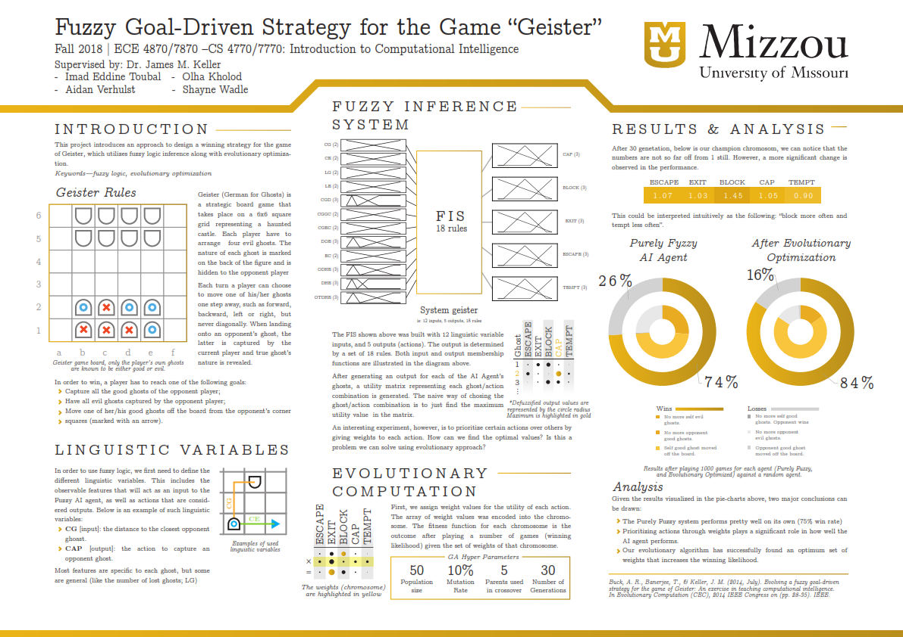

# Evolving-a-Fuzzy-Systems-for-Playing-Geister-Game

Using Evolutionary Computation for Optimizing a Fuzzy Systems to Play Geister Game. Geister (Ghosts) is a board game designed by Alex Randolph for two players, released in 1982 by Milton Bradley. ([Wikipedia](https://en.wikipedia.org/wiki/Ghosts_(board_game)))

## Getting Started

This project require that you have MATLAB software with [Fuzzy Logic Toolbox](https://www.mathworks.com/products/fuzzy-logic.html)

### Run locally

To run the training of this project, simply run the `geister_rand_sim.m` in MATLAB. 

## Built With

* [MATLAB Fuzzy Logic Toolbox](https://www.mathworks.com/products/fuzzy-logic.html) - The Fuzzy logic library used.

## Authors

* **Imad Eddine Toubal** - *Initial work* - [imadtoubal](https://github.com/imadtoubal)

## License

This project is licensed under the MIT License - see the [LICENSE](LICENSE) file for details

## Acknowledgments

* Inspiration: [Dr. James Keller's Class](https://engineering.missouri.edu/faculty/james-keller/)
* Book: [Fundamentals of Computational Intelligence: Neural Networks, Fuzzy Systems, and Evolutionary Computation (IEEE Press Series on Computational Intelligence)](https://www.amazon.com/Fundamentals-Computational-Intelligence-Evolutionary-Computation/dp/1119214343)

# Academic Poster

Happy coding!
